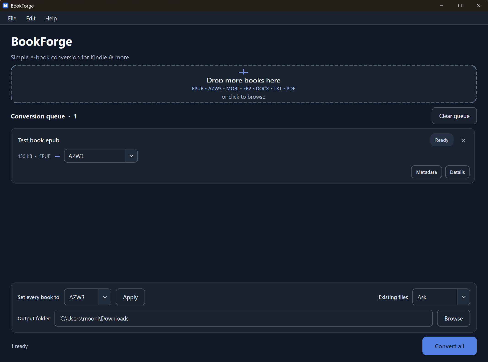

# BookForge

BookForge is a modern desktop e-book converter for Windows. It converts books and documents between common formats using Calibre, with batch conversion, metadata editing, themes, and localization.

Designed for simple local conversion—no accounts, cloud uploads, telemetry, or DRM removal.

## Screenshot



## Features

- Convert EPUB, AZW3, MOBI, FB2, DOCX, TXT, and PDF files.
- Batch-convert multiple books in one queue.
- Choose a different output format for each book.
- Edit metadata and replace cover artwork before conversion.
- Follow conversion progress when available, cancel work, retry failures, and inspect logs.
- Choose a System, Light, or Dark theme.
- Use the interface in English, German, or Russian.
- Install BookForge normally or use the portable Windows build.
- Keep books local, with no accounts, telemetry, or cloud upload.

## Supported formats

| Category | Formats |
| --- | --- |
| Input | EPUB, AZW3, MOBI, FB2, DOCX, TXT, PDF |
| Output | AZW3, EPUB, MOBI, PDF, FB2, DOCX, TXT |

BookForge lets you convert between these formats wherever Calibre supports the selected combination. AZW3 is a convenient Kindle-oriented option, although compatibility ultimately depends on the device and source material.

## Installation

### Windows installer

1. Install [Calibre](https://calibre-ebook.com/download_windows).
2. Download `BookForge-Setup-1.0.0.exe` from the [latest GitHub Release](https://github.com/MoonlighC/BookForge/releases/latest).
3. Run the installer.
4. Launch BookForge from the Start Menu.

### Portable version

1. Install [Calibre](https://calibre-ebook.com/download_windows).
2. Download `BookForge-1.0.0-Windows-x64.zip` from the latest GitHub Release.
3. Extract the ZIP to a writable folder.
4. Run `BookForge.exe`.

Python is not required for either packaged release. BookForge 1.0.0 is unsigned, so Windows SmartScreen may display a warning.

## Calibre requirement

BookForge uses Calibre's `ebook-convert` and `ebook-meta` tools. Calibre must currently be installed separately; BookForge does not bundle or modify it.

If Calibre is missing, BookForge still opens and explains that it is required before conversion can begin.

## Usage

1. Add or drop one or more books.
2. Choose the output format for each book.
3. Optionally edit metadata or replace the cover artwork.
4. Choose the output folder.
5. Click **Convert all**.

## Interface

- Languages: English, Deutsch, Русский
- Themes: System, Light, Dark

Language and theme can be changed under **Edit → Preferences** and are remembered between launches.

## Privacy

BookForge works locally on your computer.

- No accounts
- No telemetry
- No cloud uploads
- No online conversion service

Book files are processed locally using the installed Calibre tools. BookForge does not bypass or remove DRM.

## Development

BookForge requires Windows, Python 3.12 or later, and a separate Calibre installation when running from source.

```powershell
git clone https://github.com/MoonlighC/BookForge.git
cd BookForge

py -3.12 -m venv .venv
.\.venv\Scripts\python.exe -m pip install -r requirements.txt
.\.venv\Scripts\python.exe main.py
```

Run the tests:

```powershell
.\.venv\Scripts\python.exe -m unittest discover -s tests -v
```

Build the portable Windows application:

```powershell
.\.venv\Scripts\python.exe -m pip install -r requirements-dev.txt
.\.venv\Scripts\python.exe -m PyInstaller --clean --noconfirm .\BookForge.spec
```

With Inno Setup 6 installed, build the installer after the portable application:

```powershell
.\installer\build_installer.ps1
```

## License

BookForge is available under the [MIT License](LICENSE). See [Third-party notices](THIRD_PARTY_NOTICES.md) for the licenses of Python, PySide6/Qt, Calibre, and the packaging tools.
